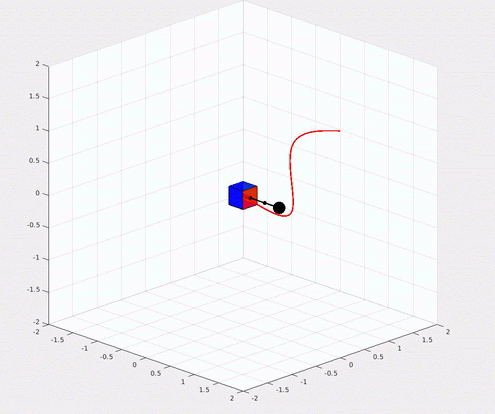
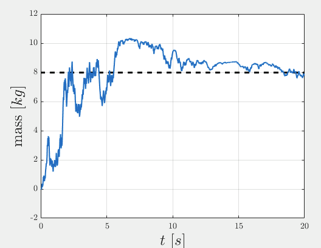

# free-flyer-adaptive-control

Free-flyer adaptive control for 6 DOF manipulation of unknown grappled objects. A sliding mode adaptive controller, feedback linearization, and PD controller are presented for manipulation of a grappled point mass by a rigid assistive free-flyer. Sample reference trajectories are also provided for use.

Accompanying [SciTech 2021 paper](https://arc.aiaa.org/doi/abs/10.2514/6.2021-2018) on this case study.

  
  An example of the "Assistive Free-Flyer Trajectory" being followed by an adaptive controller.
  

  A sample of end effector mass adaptation of the adaptive controller.

## Usage

`freeflyer_sim_main.m` is the entrypoint script for running a simulation and plotting, and contains explanatory comments.

A URDF model is imported using `urdf_to_spart_model.m`, and a `spart_free_flyer_dynamics` wrapper is created around this. `create_ref_traj.m` is used to create the reference trajectory (including the "Assistive Free-Flyer Trajectory"), and various controllers and supporting functions are also defined.

## Requirements

The [SPART MATLAB library](https://spart.readthedocs.io/en/latest/) is required for the free-flyer dynamics. See linked installation instructions.

## Function Reference

`create_ref_traj`: generates reference trajectory to follow.

`analytical_dynamics`: computes the approximate Y vector used in adaptive control using MATLAB's symbolic toolbox.

`freeflyer_dyn_adapt`: dynamics propogation function.

`freeflyer_*_control`: control callback used during dynamics propagation. The controllers are defined here!
