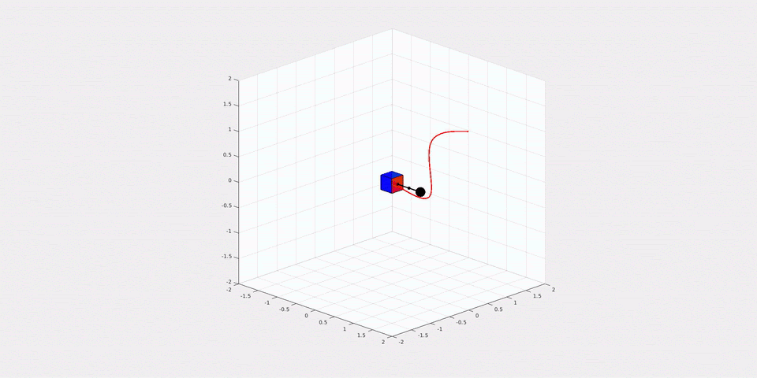

# free-flyer-adaptive-control

Free-flyer adaptive control for 6 DOF manipulation of unknown grappled objects. A sliding mode adaptive controller, feedback linearization, and PD controller are presented for manipulation of grappled point mass by a rigid assistive free-flyer. Sample reference trajectories are also provided for use.

*Updates in progress through Jan-21!*

## Usage

`freeflyer_sim_main.m` is the entrypoint script for running a simulation and plotting.

A URDF model is imported using `urdf_to_spart_model.m`, and a `spart_free_flyer_dynamics` wrapper is created around this.

## Requirements

The [SPART MATLAB library](https://spart.readthedocs.io/en/latest/) is required for the free-flyer dynamics. See linked installation instructions.

## Function Reference

`create_ref_traj`: generates reference trajectory to follow
`analytical_dynamics`: computes the approximate Y vector
`freeflyer_dyn_adapt`: performs adaptive control on the freeflyer dynamics to follow the reference trajectory
`freeflyer_dyn`: performs other control on the freeflyer dynamics to follow the reference trajectory
